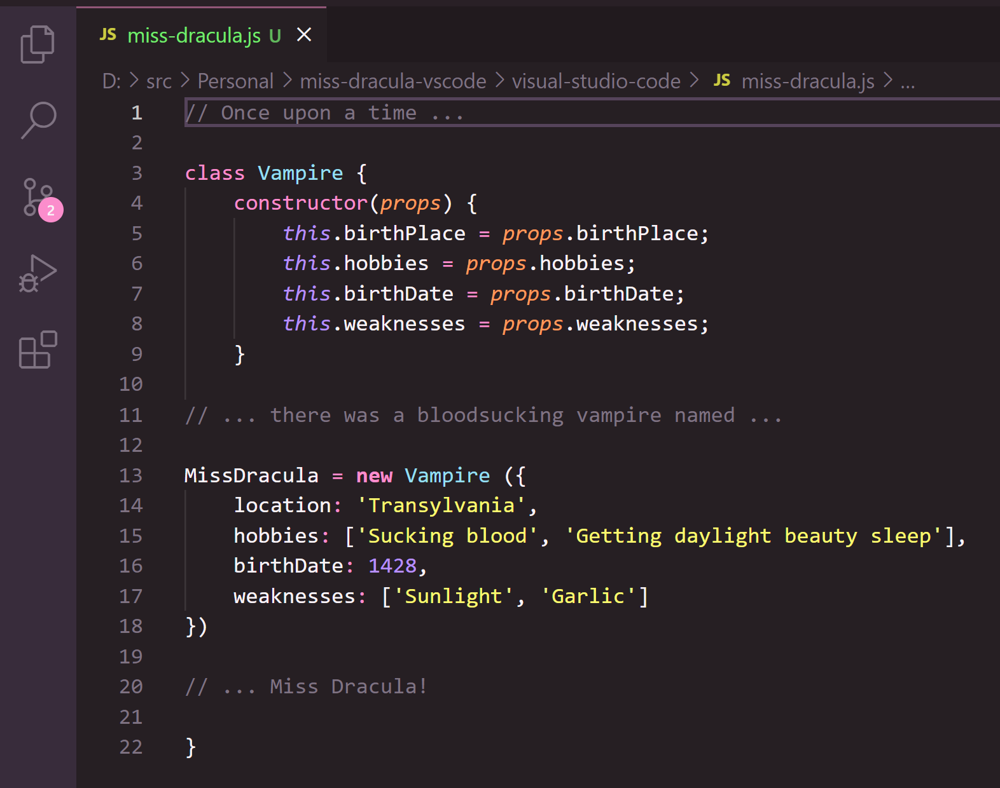

# Miss Dracula for [Visual Studio Code](http://code.visualstudio.com)

A fork of [Dracula Official](https://github.com/dracula/visual-studio-code), with a purple and magenta twist.

## Install

1.  In Visual Studio Code, go to `View -> Command Palette` or press `Ctrl+Shift+P`
2.  Then enter `Install Extension`
3.  Write `Miss Dracula`
4.  Select it or press Enter to install

## Team
Miss Dracula is maintained by [Anel Guel](https://github.com/anelguel).

The [Dracula Official](https://github.com/dracula/visual-studio-code) theme is maintained by a bunch of [awesome contributors](https://github.com/dracula/visual-studio-code/graphs/contributors). Special shout out to [Derek Sifford](https://github.com/dsifford)  for leading the vision of this project.

## Contributing

If you'd like to contribute to this theme, please read the [contributing guidelines](./.github/CONTRIBUTING.md).

## License

[MIT License](./LICENSE)
